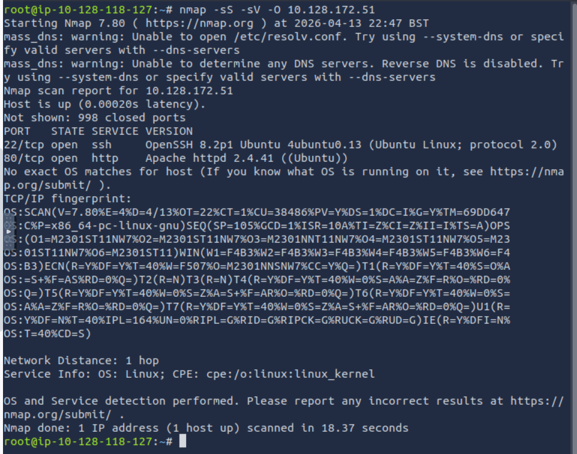

# RootMe - TryHackMe Writeup

## Introducción

Este writeup documenta el proceso de compromiso de la máquina **RootMe** en TryHackMe.

Durante el laboratorio se realizaron tareas de reconocimiento, enumeración, explotación web mediante file upload, obtención de una reverse shell y escalada de privilegios hasta conseguir acceso como **root**.

---

## Reconocimiento

Se realizó un reconocimiento inicial del objetivo para identificar servicios expuestos y posibles vectores de entrada.

Como primer paso, se ejecutó un escaneo con **Nmap** para detectar puertos abiertos y servicios activos en la máquina objetivo.

```bash
nmap -sS -sV -O 10.128.172.51
```



A partir de los resultados obtenidos, se identificaron dos servicios principales expuestos:

- **SSH (puerto 22)**: utilizado para acceso remoto al sistema.
- **HTTP (puerto 80)**: servidor web Apache.

Dado que no se dispone de credenciales para el servicio SSH, el enfoque se centra en el servicio web, ya que suele ser un vector de ataque común en este tipo de escenarios.

Por lo tanto, se decide continuar con la enumeración del servidor HTTP en busca de directorios ocultos o funcionalidades vulnerables.


## Enumeración

Dado que el servicio HTTP se encuentra disponible, se procedió a realizar una enumeración de directorios utilizando Gobuster.

```bash
gobuster dir -u http://10.128.172.51 -w /usr/share/wordlists/dirbuster/directory-list-2.3-medium.txt
```


